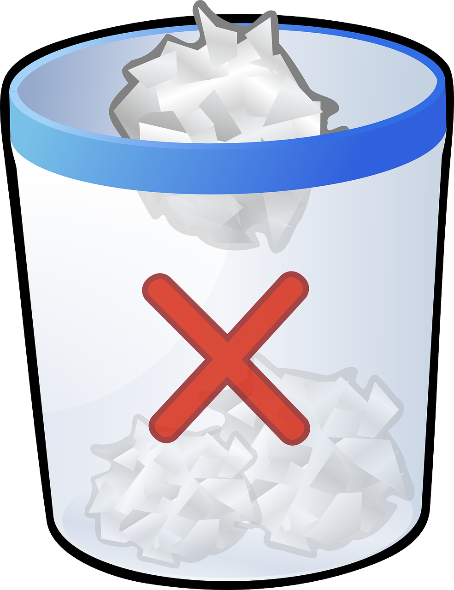

<div align="center">
  
  
  
# [Let's Do List!](fac29a.github.io/Zukhra-Esti-Project)

</div>

"Let's Do List!" is a collaborative project created by [Zukhra](https://github.com/Zu18) and [Esti](https://github.com/Estishi87) to help you stay organized and manage your tasks effectively. It's a responsive web application that can be accessed from various devices, such as laptops, tablets, and smartphones.

## Table of Contents

- [Installation](#Installation-Instructions)
- [Usage](#usage)
- [Features](#features)
- [Branching and Collaboration](#branching-and-collaboration)
- [Project Planning](#project-planning)
- [Documentation](#documentation)
- [Tests](#tests)
- [Acknowledgments](#Acknowledgments)
- [Contributing](#contributing)
- [Contact](#contact)

## Installation Instructions

Our next steps involve delving deeper into testing, enhancing code accessibility, making minor improvements, and subsequently creating a presentation. Stay tuned for updates!

## Usage

https://github.com/FAC29A/Zukhra-Esti-Project/assets/125391502/3011633c-5129-4850-bc19-a12e0cb5ad60

1. Add New Tasks: Simply type your new task in the input field and click the "+" button.


2. Organize Tasks: Use drag-and-drop to move tasks between the "To-Do," "In Progress," and "Complete" sections.

3. Delete Tasks: Drag a task to the bin folder to delete it.  

## Features

"Let's Do List!" offers a simple yet powerful task management system with three separate sections:


1.  **To-Do:** Create new tasks and organize your to-do list.

2.  **In Progress:** Move tasks here to indicate that you're currently working on them.

3.  **Complete:** Move completed tasks to this section for a sense of accomplishment.

The standout feature is the drag-and-drop functionality that allows you to move tasks between these sections. Additionally, you can easily delete tasks by dragging them to the bin folder.


## Branching and Collaboration

We employed a collaborative development approach using Git branches. Here's how it worked:

1. We each worked on separate branches when implementing new features or making changes to the code.

2. After thoroughly testing and reviewing our respective branches, we pushed the changes.

3. Once we were confident in the code, we merged everything into the main branch for deployment.

## Project Planning


We found GitHub's project planning tool to be extremely valuable for staying organized and efficiently managing our tasks. It allowed us to create and assign tasks, track progress, and maintain a clear roadmap for the project.

## Documentation

You can find detailed instructions on how to use "Let's Do List!" on the project instructions page. Visit [Project Instructions](https://learn.foundersandcoders.com/course/syllabus/foundation/testing/project/) to learn more.

## Tests

Testing played a vital role in ensuring the reliability and functionality of "Let's Do List!" We invested time in learning testing and implemented tests for each method in the project. This approach helped us identify and rectify issues and provided a level of automation in our testing process.

```
//First test group: Modal open and close

test("Opening and closing the modal", () => {
    const modal = document.getElementById("modal");
    const openModalBtn = document.getElementById("open-modal-btn");
    // Click the open button to open the modal
    openModalBtn.click();
    equal(modal.style.display, "block", "Modal should be open");
    const closeModalBtn = document.getElementById("close-modal");
    // Click the open button to close the modal
    closeModalBtn.click();
    equal(modal.style.display, "none", "Modal should be closed");
});
```

## Acknowledgments

- We utilized ChatGPT to enhance our code and improve our understanding of testing.
- Special thanks to Fac28 project by Nich and Carlos, whose example proved helpful. [Check it out here](https://github.com/fac28/todo-list-nicarlos).

## Contributing

We appreciate any feedback or improvements you might have. Feel free to contribute to our project!

## Contact

We are excited to share "Let's Do List!" with you, and we hope it helps streamline your task management and organization.

For any questions or feedback, please feel free to contact us.

[Zukhra & Esti](https://fac29a.github.io/Zukhra-Esti-Project/)
